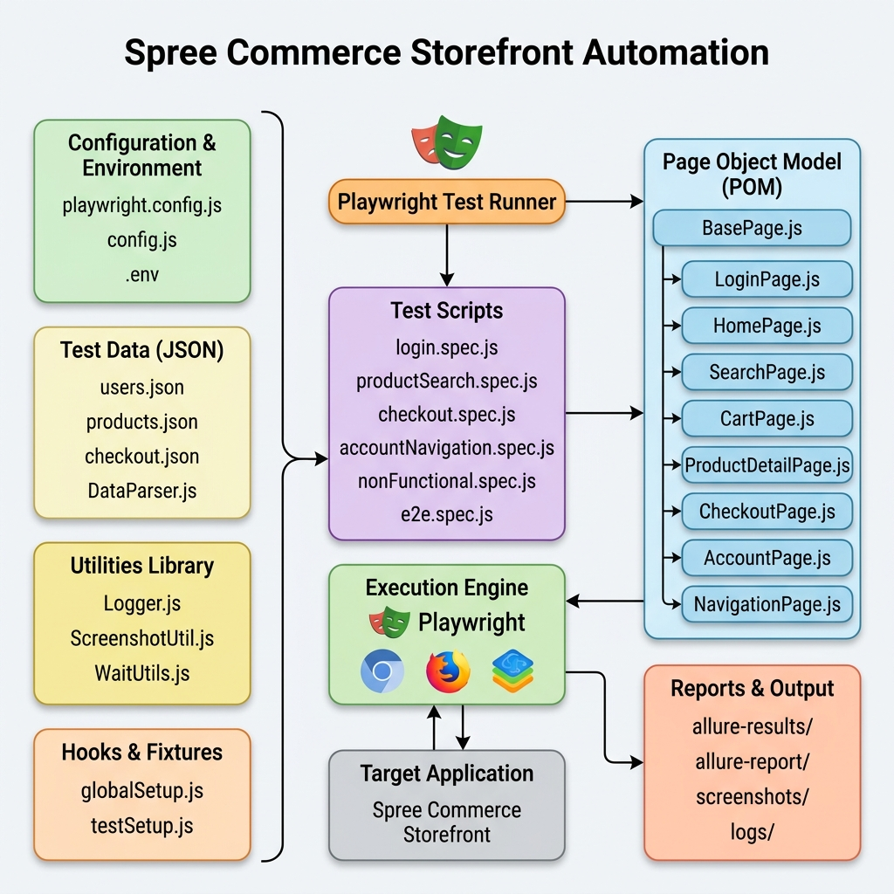

# 🎭 Playwright Automation Framework — Spree Commerce Storefront

## 👥 Project & Group Details
* **Course:** Software Testing
* **Section:** BCS-8A
* **Instructor:** Sir Haris Irfan
* **Group Members:**
  1. **Muhammad Umer Ahmed Abbasi** (Roll No: **22K-4599**)
  2. **Jawwad Ahmed** (Roll No: **22K-4648**)
* **Target Application URL:** [Spree Commerce Storefront](https://demo.spreecommerce.org/us/en/)

---

## 📝 1. Project Objective & Requirements Matrix

This project implements a robust, industry-standard end-to-end automation testing framework using **Playwright with JavaScript** for the Spree Commerce Storefront application. 

Below is the verification matrix showing how each requirement from the `Project Description.docx` has been met:

| Requirement from Project Document | Codebase Implementation Details | File References |
|:---|:---|:---|
| **Choose an Application** | Automated the Spree Commerce demo e-commerce storefront. | `.env` (`BASE_URL`) |
| **Framework Architecture** | Designed a 3-column architecture (Inputs ➡️ Execution ➡️ POM ➡️ Outputs). | `framework_diagram.png` |
| **Page Object Model (POM)** | Abstracted all UI locators and actions into individual page classes. | `pages/BasePage.js` & `pages/*.js` |
| **Data-Driven Testing** | Separated test inputs into JSON configurations loaded at runtime. | `data/*.json`, `utils/DataParser.js` |
| **Reporting (Allure)** | Integrated `allure-playwright` generating HTML reports with metrics. | `package.json`, `allure-results/` |
| **Screenshots of Failures** | Automatically captures and attaches screenshots to Allure reports on step failures. | `utils/ScreenshotUtil.js` |
| **Modular Core Methods** | Generalized wait actions, clicks, input fills, and alert handlers. | `pages/BasePage.js` |
| **Hooks & Fixtures** | Global setups and custom fixtures for dynamic page instantiation. | `hooks/globalSetup.js`, `fixtures/testSetup.js` |
| **Test Coverage** | Designed and executed **43 comprehensive test cases** (exceeding docx requirement). | `tests/*.spec.js` |

---

## 🗺️ 2. Framework Architecture Diagram

Below is the verified architecture and execution workflow diagram for the framework:



---

## 🔄 3. Framework Workflow Design

### 3.1. General Test Execution Path
1. **Config Ingestion:** The Playwright runner triggers, reading options from `playwright.config.js` and variables from `.env` via `config/config.js`.
2. **Data-Driven Load:** `utils/DataParser.js` parses credentials and input datasets from `data/*.json` and binds them to the test suites.
3. **Fixture Injection:** The test runner uses custom fixtures from `fixtures/testSetup.js` to automatically instantiate all necessary Page Objects (e.g., `loginPage`, `checkoutPage`) so that tests do not require manual instantiation.
4. **Action Translation:** Test scripts call descriptive action methods in child page classes. These pages call safe wrappers inside `pages/BasePage.js` to ensure elements are stable and interactive.
5. **Report & Output Compilation:** Browser actions generate diagnostic logs (via Winston logger in `utils/Logger.js`) and attach screenshots (via `utils/ScreenshotUtil.js`). Results are saved to `allure-results/`.

---

## 📂 4. File Hierarchy & Directory Structure

```directory
spree-playwright-framework/
├── .env                         # Key environment variables (BASE_URL, email, password)
├── package.json                 # Project dependencies, scripts, and libraries
├── playwright.config.js         # Core Playwright configuration (timeouts, reports, devices)
├── framework_diagram.png       # Framework architecture flow diagram image
│
├── config/
│   └── config.js                # Configuration manager parsing env variables
│
├── data/                        # JSON structured test datasets (Data-Driven Testing)
│   ├── users.json               # Positive and negative credentials
│   ├── products.json            # Search keywords and cart inputs
│   └── checkout.json            # Shipping addresses, promo codes, and cards
│
├── fixtures/
│   └── testSetup.js             # Playwright custom page object fixtures injection
│
├── hooks/
│   └── globalSetup.js           # Pre-run global setup validation
│
├── pages/                       # Page Object Model (POM) Layer
│   ├── BasePage.js              # Safe low-level wrapper methods (click, fill, wait)
│   ├── HomePage.js              # Home layout headers, search boxes, and navigation
│   ├── LoginPage.js             # Authentication form actions
│   ├── SearchPage.js            # Results grids, filters, and sorters
│   ├── ProductDetailPage.js     # Add to cart buttons, variants, and quantities
│   ├── CartPage.js              # Shopping cart drawer and checkout redirection
│   ├── CheckoutPage.js          # Shipping address, delivery methods, and payment steps
│   ├── AccountPage.js           # User dashboard navigation and edit forms
│   └── NavigationPage.js        # Global header/footer layout linkages
│
├── tests/                       # Test Scripts Layer (43 Total Test Cases)
│   ├── login.spec.js            # TC-01 to TC-10 (Authentication scenarios)
│   ├── productSearch.spec.js    # TC-11 to TC-20 (Product filtering & cart counts)
│   ├── checkout.spec.js         # TC-21 to TC-30 (Order placement validation)
│   ├── accountNavigation.spec.js# TC-31 to TC-40 (User dashboard navigation checks)
│   ├── nonFunctional.spec.js    # TC-41 to TC-42 (Viewports responsiveness checks)
│   └── e2e.spec.js              # TC-43 (End-to-End customer journey checkout flow)
│
├── utils/                       # Reusable Utilities Layer
│   ├── DataParser.js            # JSON parser helper
│   ├── Logger.js                # Winston logger configuration
│   ├── ScreenshotUtil.js        # Screenshot capture and Allure report attacher
│   └── WaitUtils.js             # Custom dynamic explicit wait conditions
│
└── logs/                        # System text logs generated during execution
```

---

## ⚡ 5. Prerequisites & Setup Commands

Ensure you have [Node.js](https://nodejs.org/) installed (version 18+ recommended) on your machine.

### 5.1. Initialize Project & Install Node Modules
Clone the repository, navigate to the folder, and run:
```bash
# Install dependencies
npm install

# Install Playwright browser binaries (Chromium, Firefox, Webkit)
npx playwright install
```

---

## 🚀 6. Test Execution Commands

### 6.1. Headless Mode (Standard Execution)
Runs tests in the background (default and recommended for CI/CD pipelines):
```bash
# Run all tests headlessly
npx playwright test

# Run a specific test script headlessly
npx playwright test tests/login.spec.js
```

### 6.2. Headed Mode (Visual Debugging)
Launches the browser UI so you can watch execution step-by-step:
```bash
# Run all tests in headed mode
npx playwright test --headed

# Run a specific test script in headed mode
npx playwright test tests/login.spec.js --headed
```

### 6.3. Running Specific Projects (Browser Engines)
```bash
# Run tests on Chromium only
npx playwright test --project=chromium

# Run tests on Firefox only
npx playwright test --project=firefox

# Run tests on WebKit (Safari) only
npx playwright test --project=webkit
```

### 6.4. Running Specific Test Files
```bash
# Run Login Tests
npx playwright test tests/login.spec.js

# Run Search Tests
npx playwright test tests/productSearch.spec.js

# Run Checkout Tests
npx playwright test tests/checkout.spec.js

# Run Account Navigation Tests
npx playwright test tests/accountNavigation.spec.js

# Run E2E Test Flow
npx playwright test tests/e2e.spec.js
```

---

## 📊 7. Allure Report Generation & Visualization

The framework outputs raw test metrics into `allure-results/` which are then parsed into a premium visual HTML dashboard.

### 7.1. Clean Previous Results
Clears old test runs to ensure a clean report:
```bash
# Clean previous results and reports
npm run clean
```

### 7.2. Generate Allure Report
Compiles execution results, logs, and screenshots into an HTML dashboard:
```bash
# Generate the report
allure generate allure-results --clean -o allure-report
```

### 7.3. Serve Allure Report
Launches a local development server to view the interactive dashboard in your default browser:
```bash
# Serve the interactive dashboard
allure open allure-report
```
*(This automatically hosts the report on a local port, letting you browse test statuses, execution times, detailed logs, and screenshots).*
